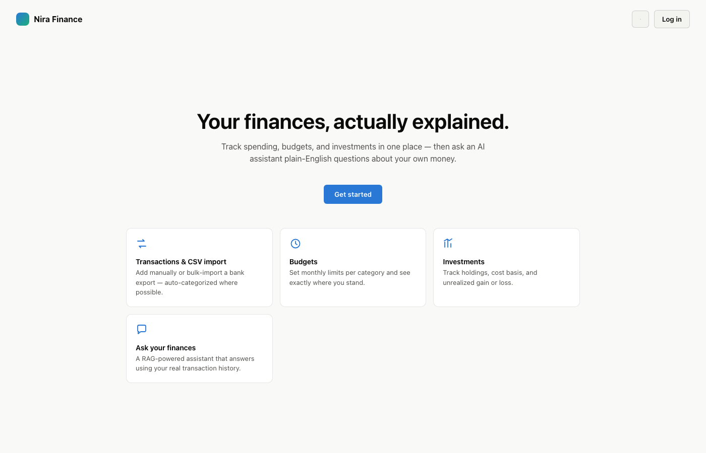
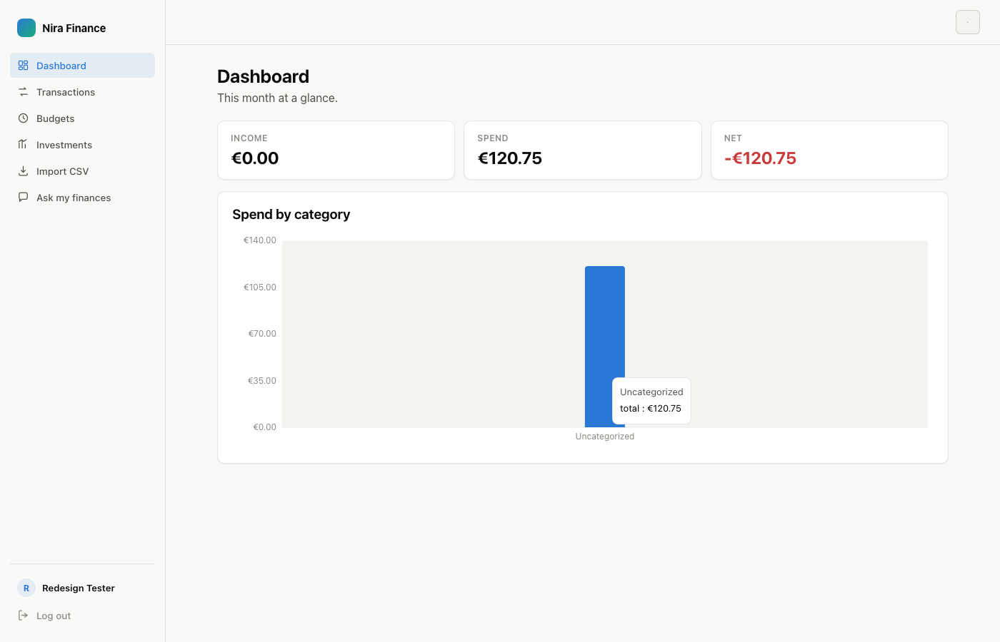
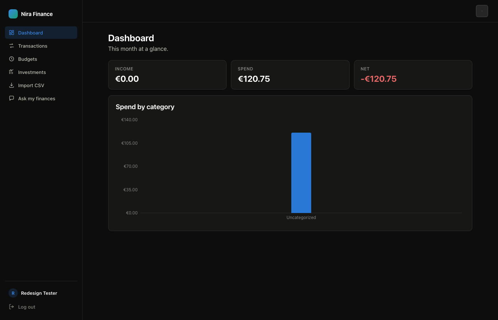
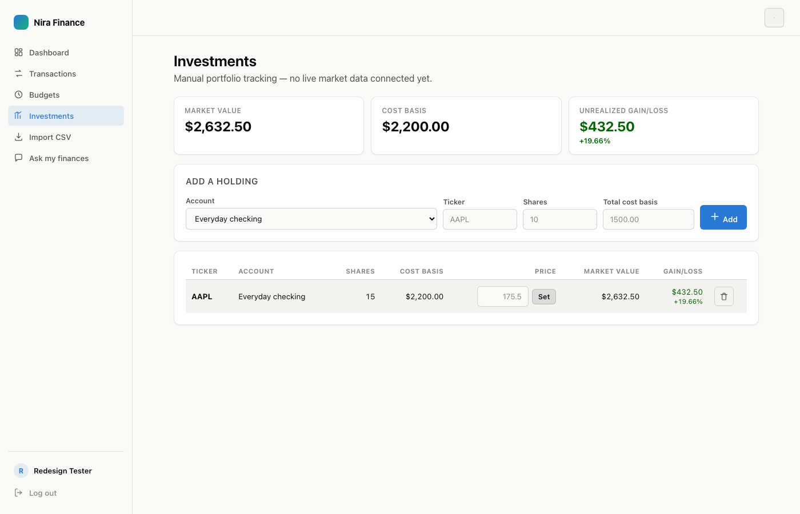

# Nira Finance

A personal finance tracker. Accounts, transactions, CSV import, budgets, and
manual investment/portfolio tracking, plus an AI chat assistant ("Ask your
finances") that answers questions about your own money using retrieval-augmented
generation (RAG) over your real transaction history.

Built as a portfolio project: **Spring Boot 3 (Java 21)** backend, **Next.js 14**
(App Router) frontend, **Postgres + pgvector** for the RAG index, JWT auth.

## Features

- **Accounts & transactions** — manual entry or bulk CSV import from a bank
  export, with rule-based categorization (AI as a fallback).
- **Budgets** — monthly spending limits per category, with over/under-budget
  status tracked in real time against actual spend.
- **Investments** — manual portfolio tracking (ticker, shares, cost basis,
  price), with server-computed market value and unrealized gain/loss.
- **Ask your finances** — a RAG-powered chat assistant: your transaction
  history is chunked, embedded, and stored in pgvector; questions retrieve the
  most relevant chunks and are answered by Claude using only that context.
- **Light/dark mode**, a real design system, and a sidebar layout throughout.

## Tech stack

| Layer | Choice |
|---|---|
| Backend | Spring Boot 3, Java 21, Spring Security (JWT), Spring Data JPA |
| Database | PostgreSQL + [pgvector](https://github.com/pgvector/pgvector), Flyway migrations |
| Frontend | Next.js 14 (App Router), React, Recharts |
| AI | Anthropic Messages API (categorization + chat); embeddings are a documented placeholder, see below |
| Docs | springdoc-openapi → Swagger UI at `/swagger-ui.html` |

## Architecture

```
frontend/   Next.js 14 (App Router) — dashboard, transactions, budgets,
            investments, CSV import, chat — light/dark design system
backend/    Spring Boot 3 (Java 21) — layered: controller -> service -> repository
  ├── model/          JPA entities (User, Account, Category, Transaction, Budget, Holding)
  ├── repository/     Spring Data JPA repositories
  ├── service/        Business logic (transactions, budgets, holdings, CSV import, analytics)
  ├── service/ai/     AiClient abstraction, Anthropic implementation, RAG pipeline
  ├── controller/     REST endpoints
  └── security/       JWT auth filter + service
```

### Design decisions

- **Every mutating endpoint verifies resource ownership before touching data.**
  `accountId`, `categoryId`, and `holdingId` supplied by the client are always
  checked against the authenticated user (`findByIdAndUserId` + a 403 on
  mismatch) before a transaction, budget, or holding is created or modified —
  one user can never read or write another user's data through the API.
- **`AiClient` is an interface**, not a hard dependency on one vendor's SDK.
  The current implementation calls the Anthropic Messages API for
  categorization and Q&A. Swapping providers means writing one new class.
- **Embeddings are a placeholder.** Anthropic doesn't offer an embeddings
  endpoint, so `AnthropicAiClient.embed()` uses a deterministic hashed
  bag-of-words vector — good enough to prove the RAG pipeline end-to-end,
  but you should swap it for a real embeddings API (Voyage AI, OpenAI, or a
  local model) before relying on the semantic search quality.
- **Investment prices are manual by design**, not a stubbed-out live feed —
  there's no market data API wired up, so `current_price` is a value you set
  yourself and the app is honest about that (an "est." badge shows when a
  holding is still valued at cost basis because no price has been set yet).
- **Rule-based categorization first, AI as fallback.** Cheaper, faster, and
  deterministic for anything that matches a category name already.
- **`GlobalExceptionHandler` catches everything**, including malformed/missing
  request parameters — no endpoint leaks a raw stack trace, SQL error, or bare
  500 to the client.
- **Interactive API docs** at `/swagger-ui.html` once the backend is running —
  every endpoint, request/response shape, and the JWT auth requirement,
  browsable without reading the controller source.

## RAG pipeline (the "ask your finances" feature)

1. `FinanceIndexingService.reindexUser()` turns your transaction history into
   text chunks — one per (month, category) spend summary, one per large
   individual transaction — and embeds + stores each in the `finance_embedding`
   table (a pgvector column).
2. `RagChatService.ask()` embeds your question, does a cosine-similarity
   lookup (`embedding <=> query`) to pull the most relevant chunks, and asks
   the LLM to answer using only that context.
3. `POST /api/chat/reindex` refreshes the index; the frontend calls it
   automatically after a CSV import.

## Running it locally

### 1. Database
```bash
docker compose up -d db     # Postgres + pgvector, one command
```

### 2. Backend
```bash
cd backend
export AI_PROVIDER_API_KEY=sk-ant-...        # your Anthropic API key
export JWT_SECRET=$(openssl rand -base64 32)
./mvnw spring-boot:run
./mvnw test                                  # JwtServiceTest, CategorizationServiceTest, BudgetServiceTest — H2, no DB needed
```
Visit `http://localhost:8080/swagger-ui.html` once it's up.

### 3. Frontend
```bash
cd frontend
npm install
npm run dev
```

Visit `http://localhost:3000` — sign up, then head to the dashboard.

## Roadmap / good next additions
- [x] Signup/login UI, budgets UI, investments UI
- [x] Docker Compose for the database
- [x] Global exception handling (consistent error JSON, no leaked stack traces or bare 500s)
- [x] OpenAPI/Swagger docs
- [x] Per-resource ownership checks on every mutating endpoint
- [x] Light/dark mode design system
- [x] Tests: JWT round-trip, rule-based categorization, budget-vs-spend math

## License

MIT — see [LICENSE](LICENSE).

<p align="center">
  
</p>
<p align="center">
  
  
</p>
<p align="center">
  
</p>
